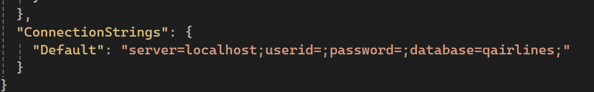

# QAirlines

## Server Project Setup Guide
### Navigate to this directory:

`your_directory\QAirline\api\QAirlines.API`

### Install .NET Tools

Open the terminal and run the following command:

```cli
dotnet tool install --global dotnet-ef
```

### Set up database connection

Create `appsettings.Development.json` file with the following content:
```json
{
  "Logging": {
    "LogLevel": {
      "Default": "Information",
      "Microsoft.AspNetCore": "Warning"
    }
  },
  "ConnectionStrings": {
    "Default": "server=localhost;userid=;password=;database=qairlines;"
  }
}
```
<br/>

Enter your MySQL username and password in the `userid` and `password` field, respectively.




### Create and apply migration

Add new migration ( if there's not a Migration folder inside `QAirlines.Migrations` folder )

```cli
dotnet ef migrations add <migration_name> --project ../QAirlines.Migrations
```

Update the database ( if you don't have one )

```cli
dotnet ef database update
```